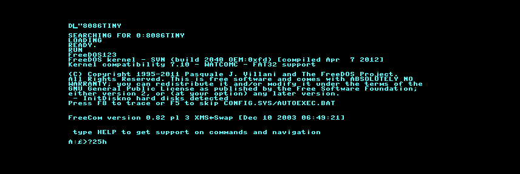

8086tiny-c128
=============

8086tiny-c128 is a port of [Adrian Cable's 8086tiny](https://github.com/adriancable/8086tiny) to the Commodore 128. This is currently a work in progress and
my code changes are still a disgusting mess.
While the current version should work on native hardware, it is currently most useful in an emulator
such as VICE in "warp" mode.

If your business needs (!!) require a faster x86 emulation solution on your 
8 bit Commodore computer, consider [the C64 port of y86](https://gitlab.com/seapeaemm/y86).

## Requirements
* Real or emulated Commodore 128
* 4 MB Ram Expansion Unit or 4 MB of SuperCPU RAM
* Hard drive or solid state drive with at least 2 MB of space (mostly for 1.44 MB floppy boot image)
* 80 column display
* A UNIX-like build environment with make
* llvm-mos SDK v22.5.0 or higher

### Things that work
* FreeDOS from 2012 boots
* Simple command line applications that only use text mode and don't make too many crazy demands on
cursor positioning should be usable.

### Things that don't work
* real time clock
* many keys on the keyboard (e.g. CTRL-ALT-DELETE doesn't work)
* hard drive
* graphics modes
* characters such as underscores and curly braces
* speaker or other audio device
* 1571 and 1581 and FD2000/4000 MFM disk support
* mouse
* lots of other things (welcome to open an issue if you don't believe it is mentioned)

### To build

Currently there are several Makefiles to target several platforms

* To build for a UNIX-like environment, just type `make`
* To build for a Commodore 64 with 4 MB REU, type `make -f Makefile.c64`
* To build for a Commodore 64 with a SuperCPU and 4 MB of SuperCPU RAM, type `make -f Makefile.scpu64`
* To build for a Commodore 128 with 4 MB REU, type `make -f Makefile.c128`
* To build for a Commodore 128 with a SuperCPU128 and 4 MB of SuperCPU RAM, type `make -f Makefile.scpu128`

### To run

For UNIX-like environments, just type `./runme` as in the original version of 8086tiny.

For the C64/128, first type `LOAD"LOADRAM",8` followed by `RUN` to load the bios (`bios`) and boot disk 
image (`fd.img`) into RAM. To start the emulator, type `LOAD"8086TINY",8` followed by `RUN`.
